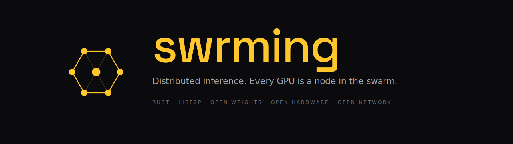

<!--
  This file lives at github.com/Swrming/.github/profile/README.md
  It renders on the public org page: https://github.com/Swrming
-->

<picture>
  <source media="(prefers-color-scheme: dark)" srcset="./assets/banner-dark.svg">
  <source media="(prefers-color-scheme: light)" srcset="./assets/banner-light.svg">
  
</picture>

---

## What swrming is

Swrming is a peer-to-peer network that runs open-source LLMs across community GPUs.

**Workers** contribute VRAM and earn for tokens served. **Foragers** submit prompts. The swarm splits each model's layers across peers, routes the token chain from one worker to the next, and settles usage on a verifiable ledger. One datacenter, replaced by thousands of GPUs that already exist.

Built in Rust on [libp2p](https://libp2p.io). One binary, two roles. Metal, CUDA, ROCm, WGPU.

---

  
   
  Open weights. Open hardware. Open network.

